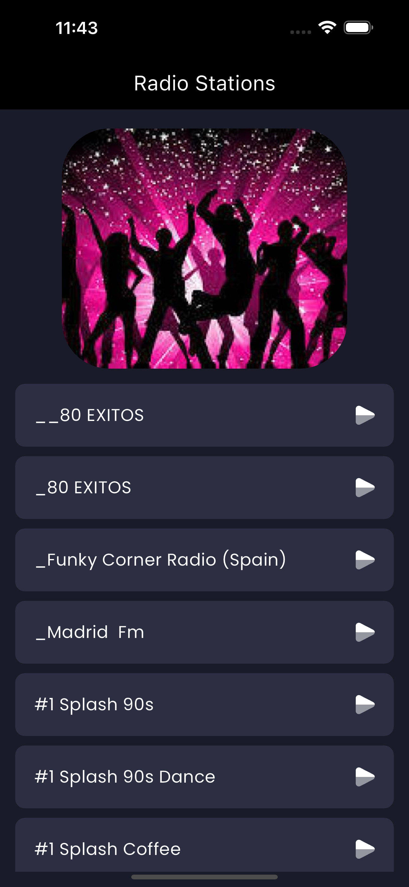
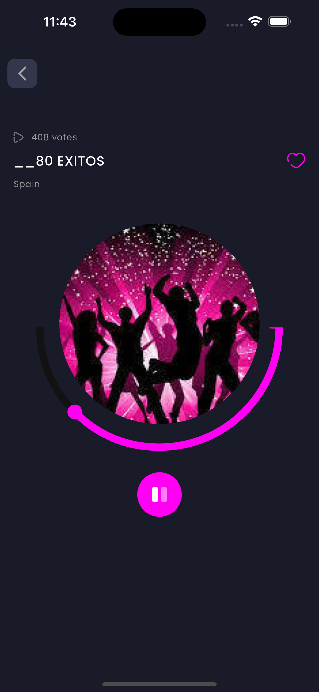
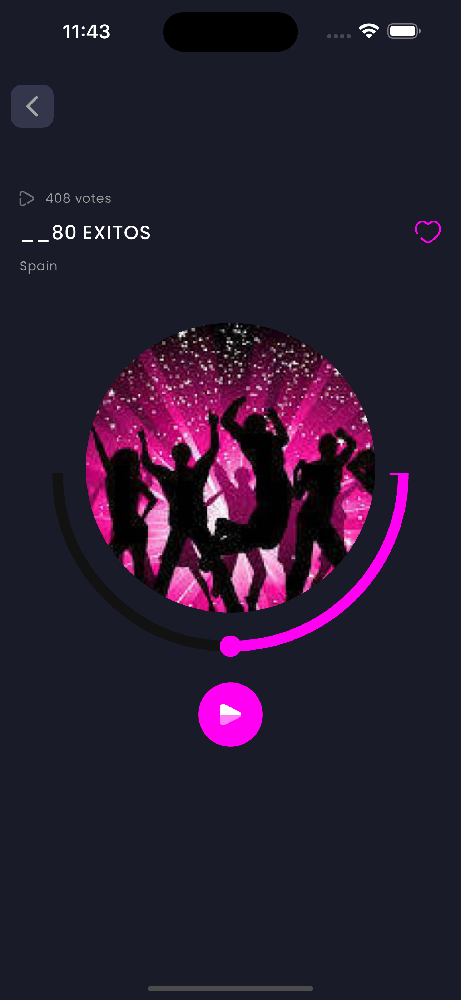

# radioapp

A new Flutter project.

## Getting Started

This app is just another flutter project to play and learn.

It is an app that allows you to load a set of radio stations consuming the free api https://api.radio-browser.info (no api key is needed). To run the app follow the steps below:

- Download the code.
- In the root folder run `flutter pub get && flutter run`

If everything goes fine, you should see something like this:

<video width="280" height="240" controls>
  <source src="./screenshots/video.mov" type="video/mp4">
</video>

For help getting started with Flutter development, view the
[online documentation](https://docs.flutter.dev/), which offers tutorials,
samples, guidance on mobile development, and a full API reference.
